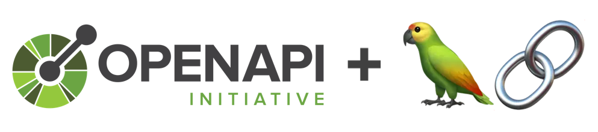

# openapi2tools

[](https://github.com/langchain-ai/langchain/releases)
[](https://opensource.org/licenses/MIT)

Convert an OpenAPI spec to LangGraph tools 🪄

## Concepts
1. [LangChain](https://python.langchain.com/v0.2/docs/introduction/) is a framework for developing apps powered by large language models (LLMs).
2. [LangGraph](https://langchain-ai.github.io/langgraph/), introduced by 
`LangChain` starting from v0.2, facilitates building [Agents](https://python.langchain.com/v0.2/docs/tutorials/agents/) based apps that leverage and extend a LLM to perform tasks outside of its traditional domain. The heart of the agents is [Tool calls](https://python.langchain.com/v0.2/docs/how_to/tool_calling/#tool-calls).
3. [OpenAPI ](https://learn.openapis.org/introduction.html) Specification (OAS) is a standard format for defining APIs, allowing both humans and machines to understand the capabilities of a service without accessing its source code, documentation, or network traffic.

Companies worldwide have invested billions 💰💰💰 into developing APIs. In the new AI era, a question begs, how to leverage the power of natural language processing to consume the APIs while incurring minimum costs and preserving existing investments.

**openapi2tools** addresses the challenge by converting and encapsulating an OpenAPI specification JSON into a domain-specific LangGraph `agent`, with each API represented as a `tool`.


## Installation and Usage

**openapi2tools** can be installed with pip,

```bash
pip install openapi2tools
```
After installation, you run the tool in a command line, such as the following,
```bash
openapi2tools <your_openapi_json_file> <output_python_file_name>
```